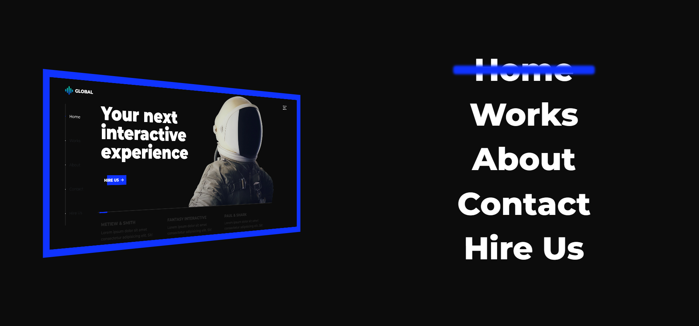
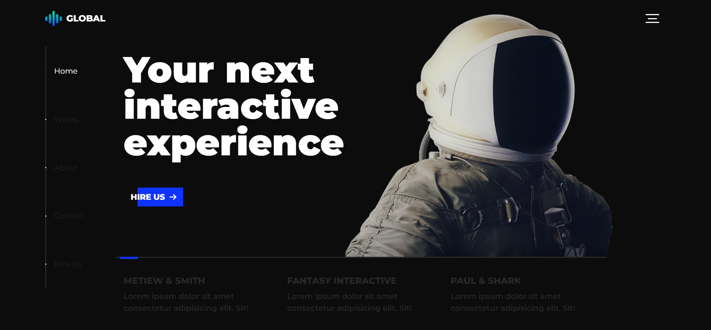
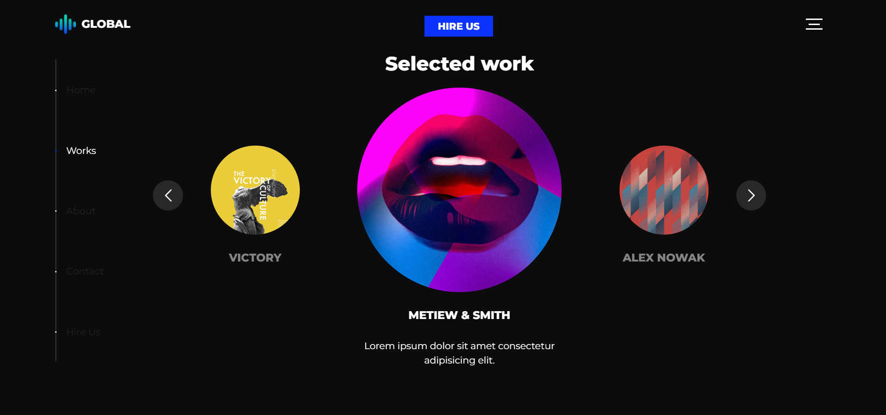
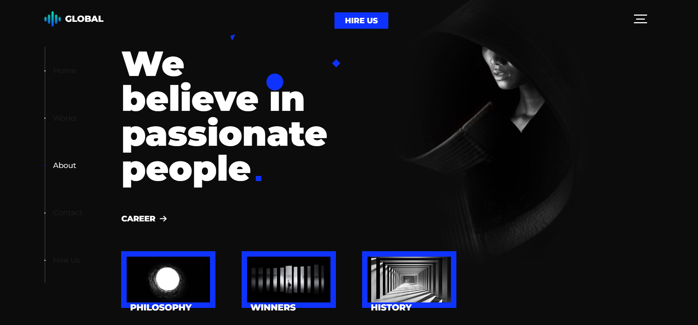
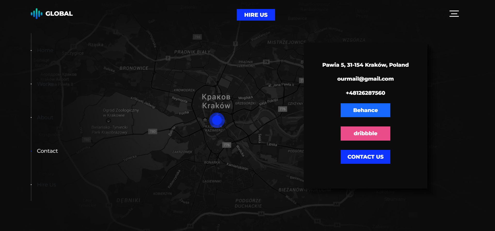
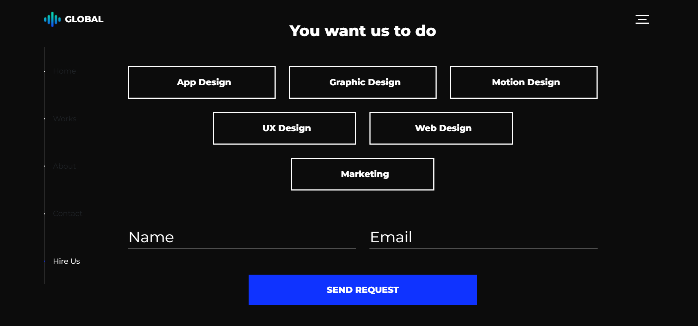

# Global inc.

A company landing page.

## Table of contents

- [Screenshot](#screenshot)
- [My process](#my-process)
  - [Built with](#built-with)
  - [What I learned](#what-i-learned)
  - [Useful resources](#useful-resources)

## Screenshot

## My process

### Built with

- Semantic HTML5 markup
- CSS
- Bootstrap
- React
- Font Awesome
- react-multi-carousel
- Autoprefixer

### What I learned

- Animating content in a 3d way when opening the nav menu
- Changing shown components on scroll
- Using react-multi-slider functions to add animations when slides transition
### Useful resources

- [Stack Overflow Answer](https://stackoverflow.com/questions/57833951/change-page-on-every-wheel-event) - This helped me with changing the shown component on wheel movement
